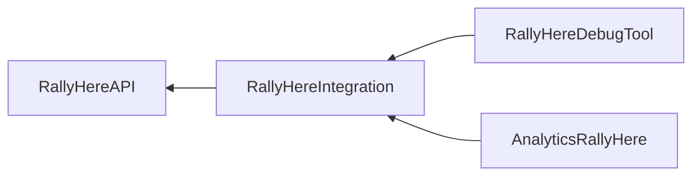

# Rally Here Unreal Integration Overview

## Plugins

The following plugins are the major players in the RallyHere Unreal Integration

- `RallyHereAPI` - an autogenerated plugin that exposes the RallyHere Web API to Unreal.  This includes hooking the engine's HTTP system to do web calls, as well as many features within the system.  Most structures and enums are exposed to blueprint.
- `RallyHereIntegration` - the primary implementation plugin, which wrappers the raw calls from RallyHereAPI and also adds blueprint hooks for the system.  This system is responsible for providing a primary implementation of Unreal Engine features using the API
- `RallyHereDebugTool` - an ImGui implementation (which by default uses the packaged UnrealImGui plugin) for rendering and interacting with the RallyHereIntegration layer
- `AnalyticsRallyHere` - An implementation of the Unreal Engine Analytics system which provides support for sending analytics data to RallyHere.  This system is not required for the integration to work, but is useful for tracking data.

The above plugins follow the following dependency tree:

Additionally, the following OnlineSubsystem plugins are provided, which have varying levels of functionality and plug into the RallyHereIntegration layer seamlessly:
- `OnlineSubsystemAnon` - An partial implementation of `OnlineSubsystem` which provides support for our Anonymous login type.  This type is useful for developers, as it able to create test accounts on demand
- `OnlineSubsystemBasic` - An partial implementation of `OnlineSubsystem` which provides support for our Basic login type (which is used by our dedicated servers).  This type may be deprecated over time.
- `OnlineSubsystemHotfix` - A partial implementation of `OnlineSubsystem` which provides support for running the engine's Hotfix manager using settings delivered by RallyHereIntegration
- `OnlineSubsystemSteamV2` - A partial implementation of `OnlineSubystemSteam` which provides support for using Steam Inventory and other missing features from the base OnlineSubsystemSteam.  Passes-through to Online Subsystem Steam for most functionality.

All of these plugins can be modified as you see fit to fit your needs, but bear in mind that new releases of the above will likely be required for taking new features.  As such, it is recommended that modifications be made with that in mind.

## RallyHereAPI Plugin

The RallyHereAPI plugin's primary job is to expose the RallyHere WebAPI to the engine in a way that Unreal expects.  It uses the engine's HTTP system to make calls, and many of its elements are exposed to blueprints (though the calls are not, because the HTTP system is not exposed to blueprint).

The source code of the plugin is autogenerated, using an utility contained in the plugin, which works off an OpenAPI specification file.  A pre-generated version is included in the SDK for convenience.

Generally, files within this plugin fall into two categories: "API" files and "Model" files.  While there are other files in this plugin, those provide exposure for the Rally Here API and data types for using that API, respectively.  There are also some utility files such as one for providing authentication information, and type conversion files.

## RallyHereIntegration Plugin

The RallyHereIntegration plugin is the main implementation plugin interfacing with the RallyHereAPI plugin.  It is responsible for managing calls to the APIs (though you can always add your own calls as needed), as well as efficient caching and best practices for using the API.

The source files for the plugins have a few common utility files (such as `RH_Common.h`, `RH_Integration.h`, etc.), though the major parts are divided into the `URH_LocalPlayerSubsystem` and `URH_GameInstanceSubsystem` subsystem classes, and their child subsystem plugins.

By design, most of the API calls and caching is contained into the above two Subsystem structures, which are wholly contained within a `UGameInstance`.  This means that in cases where multiple `UGameInstance`s exist, that they should operate separately.

Here is a breakdown of some of those subsystems and their children plugins (note - naming of some of the children may change in the future for consistency).

### Required Unreal Classes

Please refer to the (Unreal Quickstart)[./Unreal Quickstart.md] for information on how to set up the required Unreal classes.

### `URH_LocalPlayerSubsystem`

This subsystem is of type `ULocalPlayerSubsystem`, which is instantiated automatically on each `ULocalPlayer`.  It is responsible for maintaining and running player-specific calls and caches.  It also has a few utility functions.

It includes children plugins (sometimes referred to as subsystems themselves).  These include but are not limited to:

- `URH_LocalPlayerLoginSubsystem` - provides functionality for logging into the RallyHere API.  This also caches the result, and is responsible for doing basic `OnlineSubsystem` login calls and permission checking.
- `URH_FriendSubsystem` - provides functionality for retrieving, caching, and updating friends on the RallyHere API.  Also provides functionality for pulling friend data from the `OnlineSubsystem` interface and integrating it with the RallyHere friend data.
- `URH_LocalPlayerSessionSubsystem` - provides functionality for the local player to interact with RallyHere Sessions.  For more information, see [Unreal Sessions Integration](./Unreal%20Sessions%20Integration.md).
- `URH_LocalPlayerPresenceSubsystem` - provides functionality for pushing up presence information about the local player to the RallyHere API, which can then be retrieved by other players.  This includes information such as online status, AFK messages, and the like.  This is also the primary system for informing the API about your player's current state.
- `URH_EntitlementSubsystem` - provides functionality for retrieving platform (ex: Steam) entitlement information, for on-platform purchasing and redemption.
- `URH_NotificationSubsystem` - provides functionality for notifications, which are an acceleration layer for the API to allow them to update outside of their normal polling cycle

### `URH_GameInstanceSubsystem`

This subsystem is of type `UGameInstanceSubsystem`, which is instantiated automatically on the `UGameInstance`.  It is responsible for maintaining and running API calls and caches that are not player specific.  It also has a few utility functions.

Unlike the `URH_LocalPlayerSubsystem`, which is per-player, this is per-game-instance as the name implies.  It is used for doing work for the system as a whole, as well as providing caching layers that are not player specific.  It is also responsible for hosting bootstrapping utilities (which are primarily used by the server).

It includes children plugins (sometimes referred to as subsystems themselves).  These include but are not limited to:

- `URH_GameInstanceSessionSubsystem` - provides functionality for the game instance to run gameplay for a session.  This subsystem does not own the session, instead it is passed a session and will synchronize the game instance state to it such as loading maps or connecting to a server
- `URH_SessionBrowserCache` - provides functionality for searching for sessions using the session browser, and caching the results
- `URH_MatchmakingBrowserCache` - provides functionality for looking up information about matchmaking configuration objects, and caching the results.
- `URH_GameInstanceServerBootstrapper` - provides functionality for bootstrapping dedicated servers, including allocation, session determination, recycling, and shutdown.  It works closely with the `URH_GameInstanceSessionSubsystem`.  For more information, see [Unreal Sessions Integration](./Unreal%20Sessions%20Integration.md).
- `URH_PlayerInfoSubsystem` - provides functionality for looking up information on other players, including things like presence, inventory, and other data
- `URH_CatalogSubsystem` - provides functionality for looking up information in the catalog, for in-game purchases, and caching the results.
- `URH_ConfigSubsystem` - provides functionality for looking up global configuration data such Key-Values (KVs), as well as a hook for initiating hotfix application

